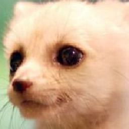
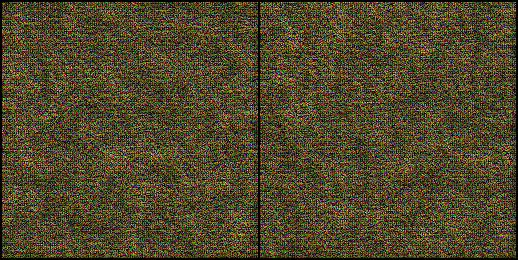

# 닮음꼴 동물 생성모델

## Introduction

While I studied Generative Adversial Network models, I wondered if I can make a GAN model which draws a animal which resembles me. It's just pure curiosity. And I'd like to create this. I built a paired human face and animal face dataset with searching on Google. Due to the characteristics of GAN, it is hard to train on personal computer. My computer's GPU RAM is just 4GB and I used Google Colab for training.

## Data Preparation

|input|output|
|:---:|:---:|
|||

## CycleGAN

[CycleGAN](https://github.com/yoonhero/Brainstormers/blob/master/study_log/Generative-Model.md#cyclegan) is one of the most popular method for image-to-image translation. I make two pairs of Generator and Discriminator. I trained this model on Google Colab for 100 epochs. 

[code](https://github.com/yoonhero/resemble_gan/tree/model-release/ResembleCycleGAN)

- First Try

